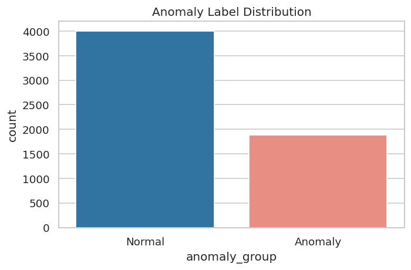
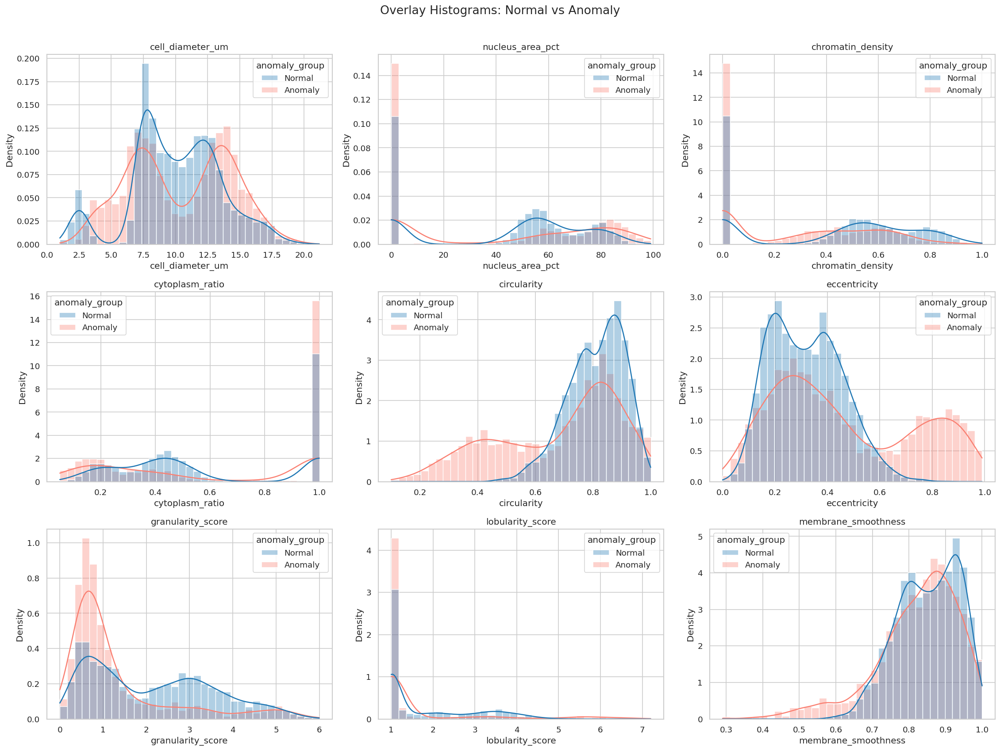
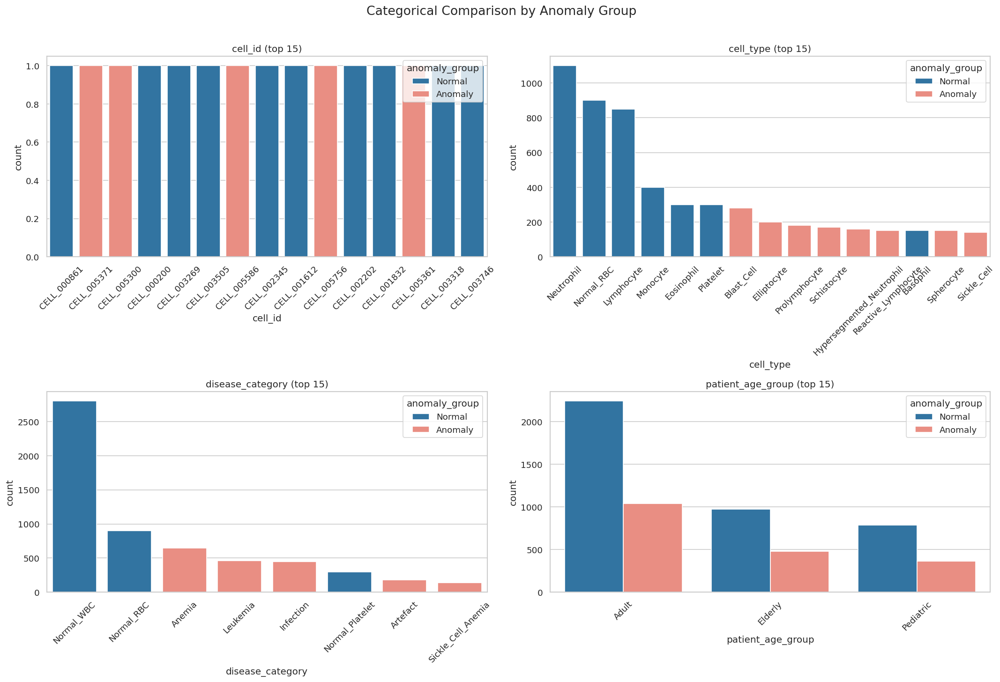
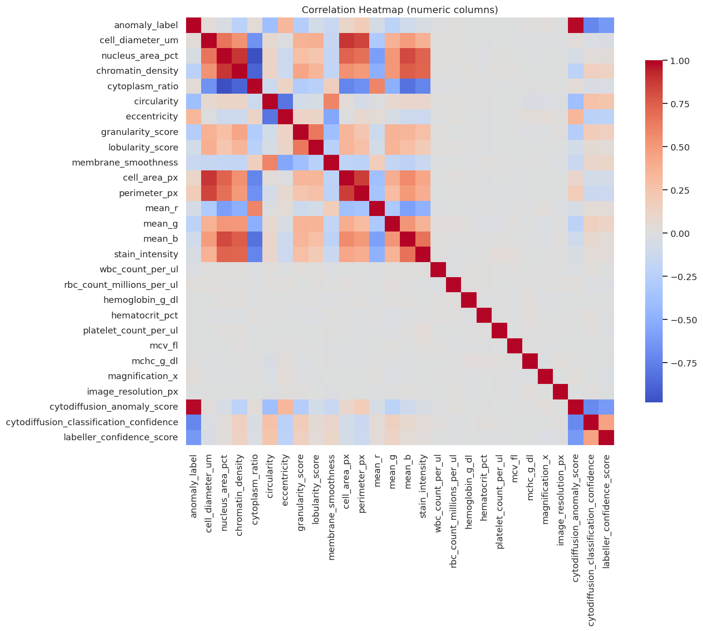
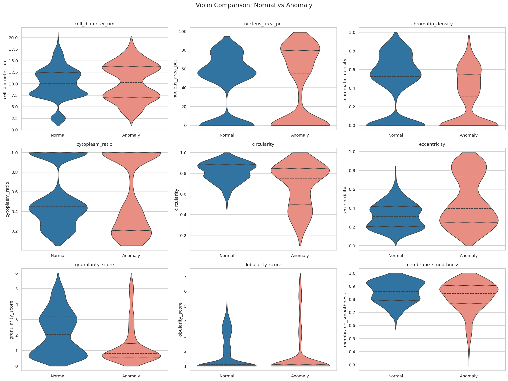
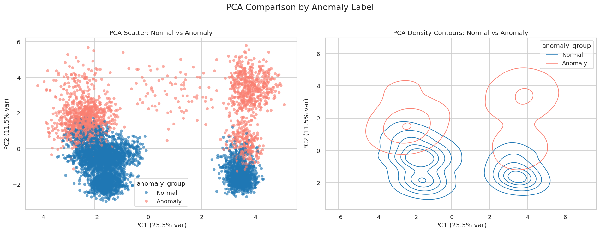
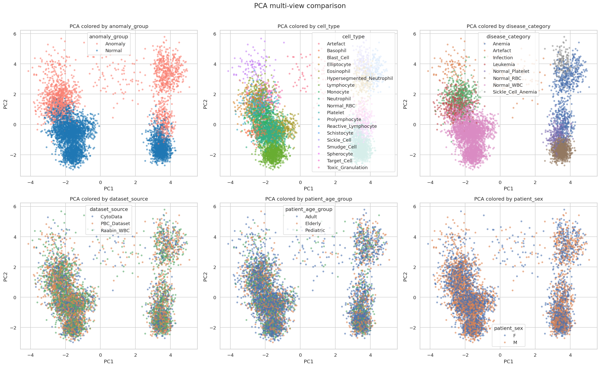

# Data Analysis Report

## Scope

This report summarizes EDA findings for:
- `cell_anomaly_dataset/blood_cell_anomaly_detection.csv`
- `cell_anomaly_dataset/cell_type_reference.csv`

All figures and tables were generated from the script pipeline under `eda/` and saved to `outputs/eda/smoke_v3/`.

## Executive summary

The dataset is structurally clean (**5,880 rows, 36 columns, no missing values, no duplicate rows**) and well-annotated, but it contains **strong label leakage signals** for anomaly classification:
- `cell_type` is perfectly aligned with `anomaly_label` (group rates are only 0 or 1).
- `disease_category` is perfectly aligned with `anomaly_label` (group rates are only 0 or 1).
- `cytodiffusion_anomaly_score` is perfectly separable by class (`Normal max = 0.2653`, `Anomaly min = 0.5092`, no overlap).

This means classification models can achieve unrealistically high performance if leakage-prone columns are included.

## Data quality and composition

| Metric | Value |
|---|---:|
| Rows | 5,880 |
| Columns | 36 |
| Numeric columns | 28 |
| Categorical columns | 8 |
| Missing values | 0 |
| Duplicate rows | 0 |
| Normal class (`anomaly_label=0`) | 4,000 (68.03%) |
| Anomaly class (`anomaly_label=1`) | 1,880 (31.97%) |

Top cell types:
- Neutrophil: 1,100
- Normal_RBC: 900
- Lymphocyte: 850
- Monocyte: 400
- Eosinophil: 300

Disease categories:
- Normal_WBC: 2,800
- Normal_RBC: 900
- Anemia: 650
- Leukemia: 460
- Infection: 450
- Normal_Platelet: 300
- Artefact: 180
- Sickle_Cell_Anemia: 140

## PCA summary

PCA was computed on scaled numeric features (excluding the target):
- **PC1 explained variance:** 25.48%
- **PC2 explained variance:** 11.46%
- **PC1+PC2 total:** 36.94%

## Main figures

### Class balance

### Overlay histograms: Normal (blue) vs Anomaly (salmon)

### Aggregated categorical comparison

### Correlation heatmap (numeric features)

### Aggregated violin comparison: Normal vs Anomaly

### PCA anomaly-focused comparison

### PCA multiview (colored by relevant columns)

## Interpretation notes

1. The class comparison visuals (overlay histograms + violin pages) clearly support feature distribution differences between Normal and Anomaly groups.
2. PCA views provide useful global structure but should be interpreted alongside leakage risk.
3. For downstream modeling, leakage-prone columns should be explicitly excluded or used only in controlled analyses.

## Artifact locations

- **Tables:** `outputs/eda/smoke_v3/tables/`
- **Univariate figures:** `outputs/eda/smoke_v3/figures/univariate/`
- **Bivariate + PCA figures:** `outputs/eda/smoke_v3/figures/bivariate/`
